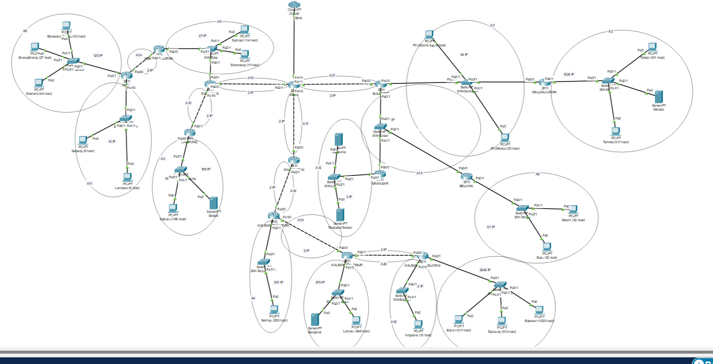
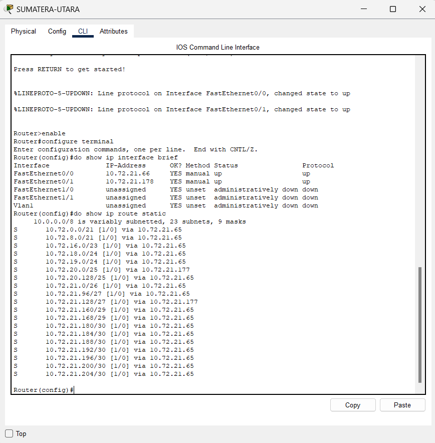
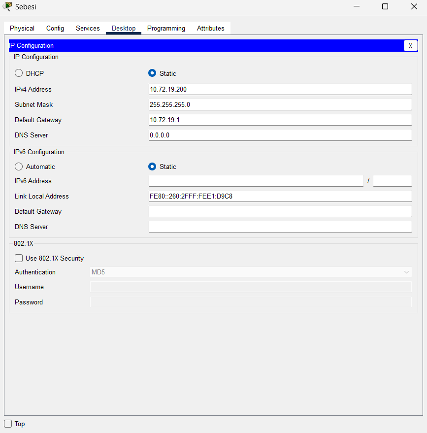
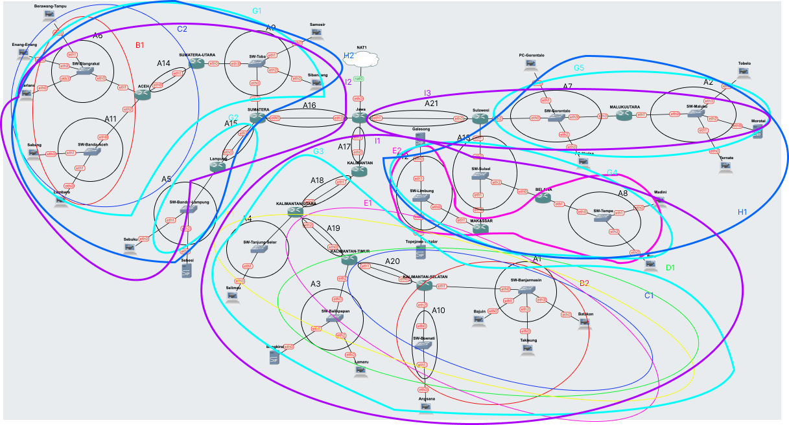

# Jarkom-Modul-4-IT17-2024

##### Praktikum Jaringan Komputer Modul 4 Tahun 2024 -Subnetting dan Routing

### Author
| Nama | NRP | Pembagian Tugas |
|---------|---------|---------|
| Mutiara Nurhaliza | 5027221010   | CIDR   |
| Aqila Aqsa | 5027211032   | VLSM   |

# Laporan Resmi
Menggunakan perhitungan ``CIDR`` dengan menggunakan ``GNS3`` dan ``VLSM`` dengan menggunakan ``Cisco``

# Daftar Isi
- [Topologi CPT](#vlsm-topologi)
- [Perhitungan VLSM](#vlsm-ip)
- [VLSM Tree](#vlsm-tree)
- [Config dan Routing](#vlsm-ping)
- [Topologi GNS3](#cidr-topologi)
- [Perhitungan CIDR](#cidr-ip)
- [CIDR Tree](#cidr-tree)
- [Config dan Routing](#cidr-ping)

## VLSM
### Topologi VLSM di Cisco Packet Tracer beserta subnet naming
<a name="vlsm-topologi"></a>



### Sheets Perhitungan IP VLSM
<a name="vlsm-ip"></a>


### Tree VLSM
<a name="vlsm-tree"></a>


### Config dan Routing pada Cisco Packet Tracer
<a name="vlsm-ping"></a>

#### Router




#### Server





#### PC


#### Testing


---

## CIDR 

<a name="cidr-topologi"></a>

### Topologi


### Penggabungan
#### Penggabungan A


#### Penggabungan B


#### Penggabungan C


#### Penggabungan D


#### Penggabungan E


#### Penggabungan F


#### Penggabungan G


#### Penggabungan H


#### Penggabungan I



#### Penggabungan J


#### Penggabungan K


### Tree
<a name="cidr-tree"></a>
Setelah dilakukannya ``penggabungan IP``, sekarang kita melakukan pembagian IP dengan menggunakan ``tree`` pada masing-masing kelompok yang telah dibuat sebelumnya sebagai berikut


### Pembagian IP
<a name="cidr-ip"></a>
Berikut merupakan hasil dari pembagian IP berdasarkan Tree yang telah dibuat sebelumnya 


### Konfigurasi network 
<a name="cidr-ping"></a>

#### Jawa
```
auto lo
iface lo inet loopback

auto eth0
iface eth0 inet dhcp

#A16 Jawa-Sumatera
auto eth2
iface eth2 inet static
address 10.80.8.1
netmask 255.255.255.252

#A17 Jawa-Kalimantan
auto eth1
iface eth1 inet static
address 10.74.0.1
netmask 255.255.255.252

#A21 Jawa-Sulawesi
auto eth3
iface eth3 inet static
address 10.76.32.1
netmask 255.255.255.252
```

#### Kalimantan

```
auto lo
iface lo inet loopback

#A17 Kalimantan-Jawa
auto eth0
iface eth0 inet static
address 10.74.0.2
netmask 255.255.255.252
gateway 10.74.0.1

#A18 Kalimantan-KalUtara
auto eth1
iface eth1 inet static
address 10.73.0.1
netmask 255.255.255.252
```
#### Kalimantan Utara 
```
auto lo
iface lo inet loopback

#A18 KalUtara-Kalimantan
auto eth0
iface eth0 inet static
address 10.73.0.2
netmask 255.255.255.252
gateway 10.73.0.1

#A4 KalUtara-SwTanjungSelor
auto eth1
iface eth1 inet static
address 10.72.128.1
netmask 255.255.255.0

#A19 KalUtara-KalTim
auto eth2
iface eth2 inet static
address 10.72.64.1
netmask 255.255.255.252
```

#### Selimau 
```
#Selimau#
#A4 Selimau-SwTanjungSelor
auto eth0
iface eth0 inet static
address 10.72.128.2
netmask 255.255.255.0
gateway 10.72.128.1  
```
#### Kalimantan Timur
```
auto lo
iface lo inet loopback

#A19 KalTim-KalUtara
auto eth0
iface eth0 inet static
address 10.72.64.2
netmask 255.255.255.252
gateway 10.72.64.1

#A3 KalTimur-SwBalikPapan
auto eth1
iface eth1 inet static
address 10.72.32.1
netmask 255.255.254.0

#A20 KalTimur-KalSel
auto eth2
iface eth2 inet static
address 10.72.16.1
netmask 255.255.255.252
```

#### Bangkirai
```
#Bangkirai#
auto eth0
iface eth0 inet static
address 10.72.32.2
netmask 255.255.254.0
gateway 10.72.32.1
```

### Lamaru
```
#Lamaru#
auto eth0
iface eth0 inet static
address 10.72.32.3
netmask 255.255.254.0
gateway 10.72.32.1
```

#### Kalimantan Selatan
````
auto lo
iface lo inet loopback

#A20 Kalsel-Kaltim
auto eth0
iface eth0 inet static
address 10.72.16.2
netmask 255.255.255.252
gateway 10.72.16.1

#A1 Kalsel-SWBanjarmasin
auto eth2
iface eth2 inet static
address 10.72.0.1
netmask 255.255.248.0

#A10 Kalsel-SWBoenati
auto eth1
iface eth1 inet static
address 10.72.8.1
netmask 255.255.255.224
````

#### Angsana
```
#Angsana#
auto eth0
iface eth0 inet static
address 10.72.8.2
netmask 255.255.255.224
gateway 10.72.8.1
```

#### Bajuin
```
#Bajuin#
auto eth0
iface eth0 inet static
address 10.72.0.2
netmask 255.255.248.0
gateway 10.72.0.1
```

#### Takijung
```
#Takisung#
auto eth0
iface eth0 inet static
address 10.72.0.3
netmask 255.255.248.0
gateway 10.72.0.1
```

#### Batakan 
```
#Batakan#
auto eth0
iface eth0 inet static
address 10.72.0.4
netmask 255.255.248.0
gateway 10.72.0.1    
```

#### Sulawesi

```
auto lo
iface lo inet loopback

#A21 Sulawesi-Jawa
auto eth0
iface eth0 inet static
address 10.76.32.2
netmask 255.255.255.252
gateway 10.76.32.1

#A13 Sulawesi-Swsulsel
auto eth2
iface eth2 inet static
address 10.76.0.129
netmask 255.255.255.248

#A7 Sulawesi-Swgorontalo
auto eth1
iface eth1 inet static
address 10.76.8.1
netmask 255.255.255.128
```
#### PC Gorontalo
```
#A7 Pc Gorontalo-Sw Gorontalo
auto eth0
iface eth0 inet static
address 10.76.8.2
netmask 255.255.255.128
gateway 10.76.8.1
```

#### PC Marissa
```
#A7 Pc Marisa-Sw Gorontalo        
auto eth0
        iface eth0 inet static
	    address 10.76.8.3
	    netmask 255.255.255.128
	    gateway 10.76.8.1
```

#### Maluku Utara
```
auto lo
iface lo inet loopback

#A7 Maluku utara-SWGorontalo
auto eth0
iface eth0 inet static
address 10.76.8.4
netmask 255.255.255.128
gateway 10.76.8.1

#A2 Maluku utara-SWMaluku
auto eth1
iface eth1 inet static
address 10.76.16.1
netmask 255.255.248.0

```

#### Tobelo
```
#Tobelo#
auto eth0
iface eth0 inet static
address 10.76.16.2
netmask 255.255.248.0
gateway 10.76.16.1
```

#### Morotai
```
#Morotai#
auto eth0
iface eth0 inet static
address 10.76.16.3
netmask 255.255.248.0
gateway 10.76.16.1
```

#### Ternate
```
auto eth0
iface eth0 inet static
address 10.76.16.4
netmask 255.255.248.0
gateway 10.76.16.1
```

#### Makassar 
```
auto lo
iface lo inet loopback

#A13
auto eth0
iface eth0 inet static
address 10.76.0.130
netmask 255.255.255.248
gateway 10.76.0.129

#A12
auto eth1
iface eth1 inet static
address 10.76.0.65
netmask 255.255.255.248
```

#### Galesong 
```
#Galesong#
#A12
auto eth0
iface eth0 inet static
address 10.76.0.66
netmask 255.255.255.248
gateway 10.76.0.65
```

#### Topejawa Takalar
```
#Topejawa-Takalar#
#A12
auto eth0
iface eth0 inet static
address 10.76.0.67
netmask 255.255.255.248
gateway 10.76.0.65
```

#### Belawa
```
auto lo
iface lo inet loopback

#A13
auto eth0
iface eth0 inet static
address 10.76.0.131
netmask 255.255.255.248
gateway 10.76.0.129

#A8 Belawa - SWTempe
auto eth1
iface eth1 inet static
address 10.76.0.1
netmask 255.255.255.192
```

#### Madini
```
#Madini#
#A8
auto eth0
iface eth0 inet static
address 10.76.0.2
netmask 255.255.255.192
gateway 10.76.0.1
```

#### Baru
```
#Baru#
#A8
auto eth0
iface eth0 inet static
address 10.76.0.3
netmask 255.255.255.192
gateway 10.76.0.1
```


#### Sumatera
```
 auto lo
iface lo inet loopback

#A16 Sumatera-Jawa
auto eth0
iface eth0 inet static
address 10.80.8.2
netmask 255.255.255.252
gateway 10.80.8.1

#A9 Sumatera-SWToba
auto eth1
iface eth1 inet static
address 10.80.2.1
netmask 255.255.255.224

#A15 Sumatera-Lampung
auto eth2
iface eth2 inet static
address 10.80.5.1
netmask 255.255.255.252
```

#### Sumatera Utara
```
auto lo
iface lo inet loopback

#A9 SumateraUtara-SWToba
auto eth0
iface eth0 inet static
address 10.80.2.4
netmask 255.255.255.224
gateway 10.80.2.1

#A14 SumateraUtara-Aceh
auto eth1
iface eth1 inet static
address 10.80.1.1

netmask 255.255.255.252
```
#### Samosir
```
#Samosir#
auto eth0
iface eth0 inet static
address 10.80.2.2
netmask 255.255.255.224
gateway 10.80.2.1
```

#### Sibandang
```
#Sibandang#
auto eth0
iface eth0 inet static
address 10.80.2.3
netmask 255.255.255.224
gateway 10.80.2.1
```

#### Aceh
```
auto lo
iface lo inet loopback

#A14 Aceh-SumateraUtara
auto eth0
iface eth0 inet static
address 10.80.1.2
netmask 255.255.255.252
gateway 10.80.1.1

#A6 Aceh-SWBlangrakai
auto eth2
iface eth2 inet static
address 10.80.0.1
netmask 255.255.255.128

#A11 Aceh-SWBandaAceh
auto eth1
iface eth1 inet static
address 10.80.0.129
netmask 255.255.255.224
```

#### Berawang Tampu
```
#Berawang Tampu
auto eth0
iface eth0 inet static
address 10.80.0.2
netmask 255.255.255.128
gateway 10.80.0.1
```

#### Enang Enang
```
auto eth0
iface eth0 inet static
address 10.80.0.3
netmask 255.255.255.128
gateway 10.80.0.1
```

#### Starland
```
auto eth0
iface eth0 inet static
address 10.80.0.4
netmask 255.255.255.128
gateway 10.80.0.1

```

#### Sabang
```
auto eth0
iface eth0 inet static
address 10.80.0.130
netmask 255.255.255.224
gateway 10.80.0.129
```

#### Lambaro
```
auto eth0
iface eth0 inet static
address 10.80.0.131
netmask 255.255.255.224
gateway 10.80.0.129
```

#### Lampung
```
#Lampung
auto lo
iface lo inet loopback   

#A15 Lampung-Sumatre 
auto eth0
iface eth0 inet static
address 10.80.5.2
netmask 255.255.255.252
gateway 10.80.5.1

#A5 Lampung-SWBandarLampung
auto eth1
iface eth1 inet static
address 10.80.4.1
netmask 255.255.255.0
```

#### Sebuku
```
#Sebuku
auto eth0
iface eth0 inet static
address 10.80.4.2
netmask 255.255.255.0
gateway 10.80.4.1
```

#### Sebesi
```
#Sebesi
auto eth0
iface eth0 inet static
address 10.80.4.3
netmask 255.255.255.0
gateway 10.80.4.1
```
### Routing 
#### Jawa
```
#Jawa
  #Sumatera
route add -net 10.80.2.0 netmask 255.255.255.224 gw 10.80.8.2
route add -net 10.80.1.0 netmask 255.255.255.252 gw 10.80.8.2
route add -net 10.80.0.0 netmask 255.255.255.128 gw 10.80.8.2
route add -net 10.80.0.128 netmask 255.255.255.252 gw 10.80.8.2
route add -net 10.80.5.0 netmask 255.255.255.224 gw 10.80.8.2
route add -net 10.80.4.0 netmask 255.255.255.0 gw 10.80.8.2

  #Sulawesi
route add -net 10.76.8.0 netmask 255.255.255.128 gw 10.76.32.2
route add -net 10.76.16.0 netmask 255.255.248.0 gw 10.76.32.2
route add -net 10.76.0.128 netmask 255.255.255.248 gw 10.76.32.2
route add -net 10.76.0.0 netmask 255.255.255.192 gw 10.76.32.2
route add -net 10.76.0.64 netmask 255.255.255.248 gw 10.76.32.2

  #Kalimantan
route add -net 10.73.0.0 netmask 255.255.255.252 gw 10.74.0.2
route add -net 10.72.128.0 netmask 255.255.255.0 gw 10.74.0.2
route add -net 10.72.64.0 netmask 255.255.255.252 gw 10.74.0.2
route add -net 10.72.32.0 netmask 255.255.254.0 gw 10.74.0.2
route add -net 10.72.16.0 netmask 255.255.255.252 gw 10.74.0.2
route add -net 10.72.8.0 netmask 255.255.255.224 gw 10.74.0.2
route add -net 10.72.0.0 netmask 255.255.248.0 gw 10.74.0.2
```
#### Sumatera
```
route add -net 10.80.4.0 netmask 255.255.255.0 gw 10.80.5.2
route add -net 10.80.1.0 netmask 255.255.255.252 gw 10.80.2.4
route add -net 10.80.0.0 netmask 255.255.255.128 gw 10.80.2.4
route add -net 10.80.0.128 netmask 255.255.255.224 gw 10.80.2.4
```

#### Lampung 
```
route add -net 0.0.0.0 netmask 0.0.0.0 gw 10.80.5.1
```

#### Sumatera Utara
```
route add -net 10.80.0.0 netmask 255.255.255.128 gw 10.80.1.2
route add -net 10.80.0.128 netmask 255.255.255.224 gw 10.80.1.2
```

#### Aceh
```
route add -net 0.0.0.0 netmask 0.0.0.0 gw 10.80.1.1
```

#### Kalimantan
```
route add -net 10.72.128.0 netmask 255.255.255.0 gw 10.73.0.2
route add -net 10.72.64.0 netmask 255.255.255.252 gw 10.73.0.2
route add -net 10.72.32.0 netmask 255.255.254.0 gw 10.73.0.2
route add -net 10.72.16.0 netmask 255.255.255.252 gw 10.73.0.2
route add -net 10.72.8.0 netmask 255.255.255.224 gw 10.73.0.2
route add -net 10.72.0.0 netmask 255.255.248.0 gw 10.73.0.2
```

#### Kalimantan Utara
```
route add -net 10.72.32.0 netmask 255.255.254.0 gw 10.72.64.2
route add -net 10.72.16.0 netmask 255.255.255.252 gw 10.72.64.2
route add -net 10.72.8.0 netmask 255.255.255.224 gw 10.72.64.2
route add -net 10.72.0.0 netmask 255.255.248.0 gw 10.72.64.2
```

#### Kalimantan Timur
```
route add -net 10.72.8.0 netmask 255.255.255.224 gw 10.72.16.2
route add -net 10.72.0.0 netmask 255.255.248.0 gw 10.72.16.2
```

#### Kalimantan Selatan
```
route add -net 0.0.0.0 netmask 0.0.0.0 gw 10.72.16.1
```

#### Sulawesi
```
#A12
route add -net 10.76.0.64 netmask 255.255.255.248 gw 10.76.0.130
#A8
route add -net 10.76.0.0 netmask 255.255.255.192 gw 10.76.0.131
#A2
route add -net 10.76.16.0 netmask 255.255.248.0 gw 10.76.8.4
```

#### Makassar
```
route add -net 0.0.0.0 netmask 0.0.0.0 gw 10.76.0.129
```

#### Belawa
```
route add -net 0.0.0.0 netmask 0.0.0.0 gw 10.76.0.129
```

#### Maluku Utara
```
route add -net 0.0.0.0 netmask 0.0.0.0 gw 10.76.8.1
```

### Testing
#### Pembagian IP per node


