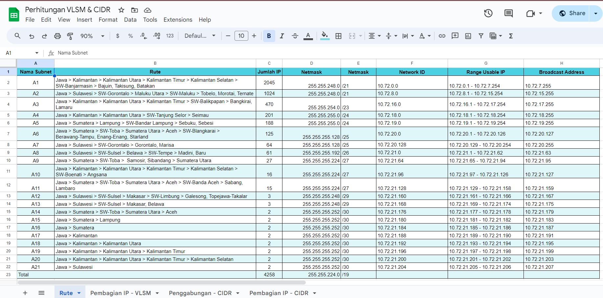

# Jarkom-Modul-4-IT17-2024

##### Praktikum Jaringan Komputer Modul 4 Tahun 2024 -Subnetting dan Routing

### Author
| Nama | NRP |
|---------|---------|---------|
| Mutiara Nurhaliza | 5027221010   | CIDR   |
| Aqila Aqsa | 5027211032   | VLSM   |

# Laporan Resmi

# Daftar Isi
- [Topologi CPT](#vlsm-topologi)
- [Perhitungan VLSM](#vlsm-ip)
- [VLSM Tree](#vlsm-tree)
- [Config dan Routing](#vlsm-ping)
- [Topologi GNS3](#cidr-topologi)
- [Perhitungan CIDR](#cidr-ip)
- [CIDR Tree](#cidr-tree)
- [Config dan Routing](#cidr-ping)

### Topologi VLSM di Cisco Packet Tracer beserta subnet naming

### Sheets Perhitungan IP VLSM

### Tree VLSM

### Config dan Routing pada Cisco Packet Tracer

#### Router

#### Server

#### PC

#### Testing

